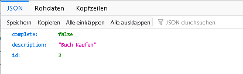
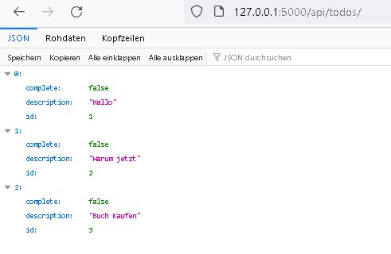

# API reference
{: .no_toc }

  

    Table of contents
  

  {: .text-delta }
- TOC
{:toc}

## API

### `def get(self, todo_id)`

**Route:** `/api/todos/<int:todo_id>`

**Methods:** `GET`

**Purpose:** returns json containing the todo with the given ID of the currend user.

**Sample output:**

---

### `def patch(self, todo_id)`

**Route:** `/api/todos/<int:todo_id>`

**Methods:** `PATCH`

**Purpose:** changes the description of the todo with the given ID of the currend user.

**Sample output:**

{'message': 'Todo updated successfully'}

---

### `def delete(self, todo_id)`

**Route:** `/api/todos/<int:todo_id>`

**Methods:** `DELETE`

**Purpose:** deletes a todo with the given ID of the currend user.

**Sample output:**

{'message': 'Todo deleted successfully'}

---

### `def get(self)`

**Route:** `/api/todos/`

**Methods:** `GET`

**Purpose:** gives all todos of the currend user.

**Sample output:**

---

### `def post(self)`

**Route:** `/api/todos/`

**Methods:** `POST`

**Purpose:** Adds a new Todo for to the currend User.

**Sample output:**

{'message': 'Todo created successfully'}, 201

---

### `run_insert_sample()`

**Route:** `/insert/sample`

**Methods:** `GET`

**Purpose:** Flush the database and insert sample data set

**Sample output:**

Browser shows: `Database flushed and populated with some sample data.`