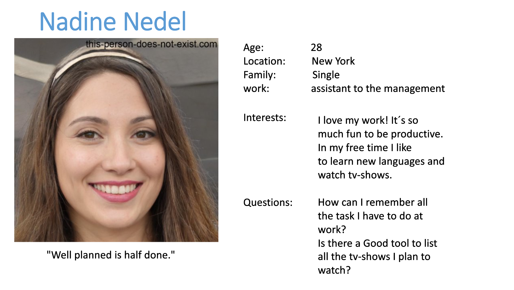

# Value proposition
{: .no_toc }

  

    Table of contents
  

  {: .text-delta }
- TOC
{:toc}

The purpose of this web application is to provide a simple method to save your todos.  
since it has an API other programs can interact with it and your todos could be shared between various applications.
If you don´t want to use the service anymore just delete your account and all your data will be deleted safely.

## Meet Nadine!
### Persona

## What does the Todo-App bring to the table?
### 5 key Features

## What does that mean for Nadine?
### Features align with value proposition and persona

Nadine not only wants to store her work todos, but also has a large list of TV-shows she still wants to watch! 
With this todo App she can do both and thanks to the lists feature she won´t mix up those areas.
Thanks to the Api features her movie-streaming service could delete the todo if one of the movies from her 
list was been watched by her. It would also be possible to add or remove movies from her list.

Nadine works for a company that does not want company secrets to become public and therefore it is very important
 that Nadine keeps control over the information she provides. With the todo app only her can see the todos she created with her account 
 and if she decides to delete her account all the todos will be deleted from the database as well!
